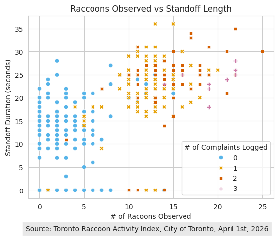

  Visualization: 
  
  Alt Text: Scatterplot of Raccoons Observed vs Standoff Length, with standoff duration in seconds on the y axis, and # of raccoons observed on the x-axis. Points are assigned a colour and shape based on the number of complaints filed per incident, with a range of 0-3 complaints per incident. General trend shows that as the number of raccoons and length of human-raccoon standoff increases, so does the number of complaints - somewhat positive association between all variables. 
  
  Source: City of Toronto Open Data, Observation Date: April 1, 2026
  
  Link to data: https://open.toronto.ca/dataset/toronto-raccoon-activity-index/ 

   > What software did you use to create your data visualization?
   Python in Google Colab because I could not get the kernel to work in VS Code 

    > Who is your intended audience? 
    The general public in the City of Toronto
    
    > What information or message are you trying to convey with your visualization? 
    The relationship between the length of raccoon encounters, the number of raccoons present, and the number of complaints filed, from raccoon encounters on April 1, 2026 in the City of Toronto
    
    > What aspects of design did you consider when making your visualization? How did you apply them? With what elements of your plots? 
    - Colour and contrast, and the accessibility of the symbols to a colour-blind audience 
    - Cognitive load - simple layout, clear labels, only including 3 variables for better interpreation 
    - 2D image, clean layout, geometric and simplified shapes, inclusion of data sources to increase trustworthiness 
    
    > How did you ensure that your data visualizations are reproducible? If the tool you used to make your data visualization is not reproducible, how will this impact your data visualization? 
    - use of publicly accessible dataset, with the source and date included
    - use of python script to create the visualization, easily reproducible by running the code 
    
    > How did you ensure that your data visualization is accessible?  
    - I used a sans-serif font, included a legend using a colour-blind friendly palette as well as shapes to code the points by # of complaints logged. 
    - I also included alternative text with Level 1-3 insights, to provide additional context for visually impaired readers. 
    
    > Who are the individuals and communities who might be impacted by your visualization?  
    - The general public
    - City of Toronto employees and animal control employees
    - THe racoons in the City of Toronto 
    
    > How did you choose which features of your chosen dataset to include or exclude from your visualization? 
    - I chose these three variables of: standoff lengths, number of raccoons and number of complaints to investigate the relationship between complaints and the 'severity' of the raccoon encounter. This visualization moved beyond descriptive stats (such as those included in the infographic), to help illustrate trends in the data. 
    
    > What ‘underwater labour’ contributed to your final data visualization product?
    - the labour of the city employeee who created the dataset
    - the VSCode and GoogleColab software engineers who created and continue to update the software used
    - assistance from the DSI Learning Support team
    - IT support staff at Adoba Illustrator and the City of Toronto